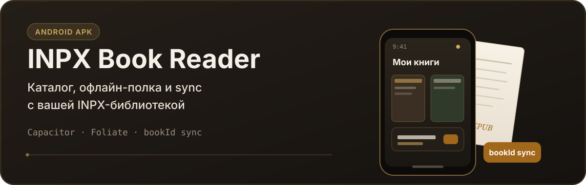
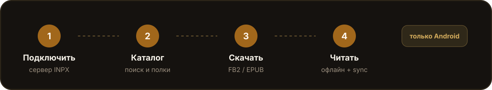
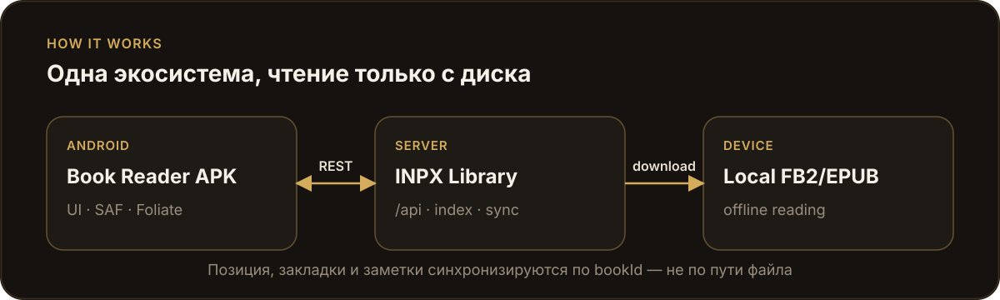

<p align="center">
  
</p>

# INPX Book Reader

Мобильная читалка **только для Android**. Каталог и sync — с [INPX Library Server](https://github.com/Habsaec/inpx-library-server); текст книги — только из скачанного файла на устройстве.

<p align="center">
  
</p>

## Что это

| Нужно | Как работает |
| --- | --- |
| Каталог, поиск, полки, профиль | REST `/api/*` сервера |
| Чтение FB2 / EPUB | Локальный файл через Foliate |
| Позиция, закладки, заметки | Sync по `bookId` |
| iOS / Desktop / PWA | Не поддерживаются |

**Без работающего INPX Library Server приложение почти бесполезно** (нет каталога, скачивания и sync). Сервер — источник правды для метаданных; путь файла на диске — snapshot при скачивании, не sync-поле.

## Требования

1. **[INPX Library Server](https://github.com/Habsaec/inpx-library-server)** уже установлен и запущен (порт по умолчанию `3000`)
2. **Node.js 20+**
3. **Android Studio** (SDK API 34+, Build-Tools, Platform-Tools) и **JDK 17**
4. Телефон и сервер в **одной Wi‑Fi сети** (для APK адрес сервера — IP ПК/NAS, не `localhost`)

Сборка APK ниже рассчитана на **Windows** (`gradlew.bat`). Подробности и troubleshooting: [`docs/ANDROID.md`](./docs/ANDROID.md).

## Быстрый путь: собрать и поставить APK

```powershell
git clone https://github.com/Habsaec/inpx-book-reader.git
cd inpx-book-reader
npm install
npm run build:android
```

Готовый файл:

`android/app/build/outputs/apk/debug/app-debug.apk`

Установка:

```powershell
adb install android\app\build\outputs\apk\debug\app-debug.apk
```

Или откройте проект в Android Studio и соберите оттуда:

```powershell
npm run android:open
```

Затем **Build → Build APK(s)** или Run ▶ на устройство.

### Первый запуск на телефоне

Приложение проводит onboarding (3 шага):

1. **Сервер** — URL вида `http://192.168.x.x:3000`, логин и пароль пользователя библиотеки → **Подключить**
2. **Папка хранения** — куда скачивать книги (SAF; по умолчанию можно оставить предложенную)
3. Готово → каталог, скачивание, чтение

Позже то же в **Настройки → Сервер**.

> HTTP без HTTPS для домашней сети разрешён (`cleartext: true` в Capacitor).
> Если нет связи: IP ПК вместо `127.0.0.1` / `localhost`, файрвол Windows для порта `3000`.

Сервер (кратко; полная инструкция в его README):

```powershell
git clone https://github.com/Habsaec/inpx-library-server.git
cd inpx-library-server
# Windows: install.cmd → start-server.cmd
# Первый вход часто: admin / admin — сразу смените пароль
```

## Как устроено

<p align="center">
  
</p>

```text
Android APK  ←── REST /api/* ──→  INPX Library Server
     │
     └── скачивание → локальные FB2/EPUB → Foliate (офлайн)
```

## Dev в браузере (только отладка)

Браузер — временный инструмент, не целевая платформа. `server.ts` — прокси **только для localhost**; в APK не используется.

1. Запустите INPX Library Server на порту `3000`.
2. В этом репо:

```powershell
npm install
npm run dev
```

3. Откройте `http://localhost:3100` → укажите сервер `http://127.0.0.1:3000` → подключитесь.

С телефона по Wi‑Fi (оба процесса на ПК): reader `http://<IP-ПК>:3100`, библиотека `http://<IP-ПК>:3000`.

## Стек

| Слой | Технология |
| --- | --- |
| UI | React 19 · TypeScript · Tailwind 4 · Capacitor 7 |
| Читалка | Foliate (iframe) |
| Натив | BookStorage · FolderPicker · ReaderNative · SAF |
| API | `src/lib/inpxClient.ts` → CapacitorHttp |

## Полезные команды

```powershell
npm run lint              # tsc --noEmit
npm test                  # vitest
npm run build:app         # веб-сборка для Capacitor
npm run build:android     # build:app + cap sync + debug APK
npm run android:sync      # cap sync без полной пересборки веба
npm run android:open      # Android Studio
npm run verify:api-parity # сверка API с сервером
```

После правок UI: снова `npm run build:android` (или `build:app` + `android:sync`), затем Run / переустановка APK.

## Связанные проекты

| Репозиторий | Роль |
| --- | --- |
| [inpx-book-reader](https://github.com/Habsaec/inpx-book-reader) | Android-клиент (этот репо) |
| [inpx-library-server](https://github.com/Habsaec/inpx-library-server) | API, индекс INPX, sync |

Контракт API и sync для разработки: [`AGENTS.md`](./AGENTS.md). Сборка и типичные ошибки: [`docs/ANDROID.md`](./docs/ANDROID.md).
